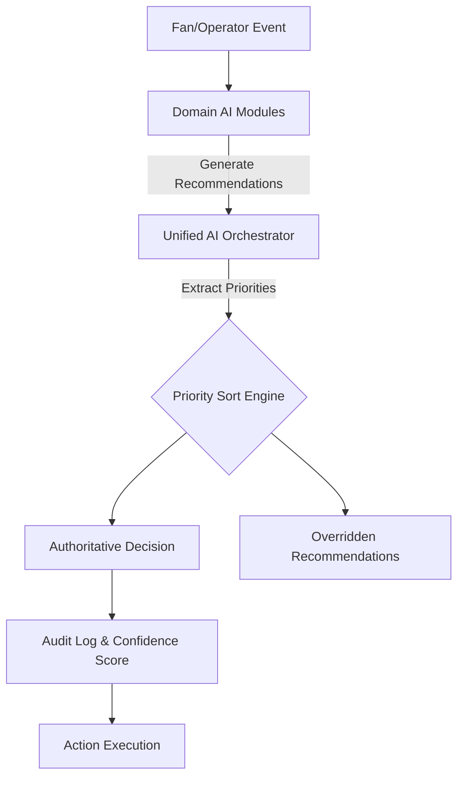

# AI Pipeline & Orchestration

**StadiumMind AI** utilizes a multi-agent AI architecture. Instead of relying on a single monolithic LLM prompt, the platform distributes intelligence across specialized domain agents, which are then governed by a central **Unified AI Orchestrator**.

Designed for the **PromptWars Virtual Challenge-4 (Smart Stadiums & Tournament Operations)**, this architecture prevents "AI deadlocks" during critical emergencies.

---

## 🤖 Domain AI Agents

The platform features several specialized heuristic and generative AI pipelines:

### 1. Crowd Intelligence AI (`crowd_ai.py`)
- **Purpose:** Spatial density calculation and safe-route wayfinding.
- **Mechanism:** Translates raw occupancy data into a 0-1 density index and generates bypass routes around congested zones.

### 2. Operations & Volunteer AI (`ai_engine.py`, `volunteer_ai.py`)
- **Purpose:** Incident triage and resource dispatch.
- **Mechanism:** Matches incident severity to the closest, most qualified volunteer (e.g., prioritizing volunteers with `medical_training=True`).

### 3. Transport Intelligence AI (`transport_ai.py`)
- **Purpose:** Eco-routing and energy optimization.
- **Mechanism:** Recommends ADA-compliant parking and shuttle routes; calculates automated light-dimming based on crowd density.

### 4. Emergency Knowledge Assistant (`emergency_ai.py`)
- **Purpose:** Immediate, hallucination-free protocol retrieval.
- **Mechanism:** Keyword-based Retrieval-Augmented Generation (RAG).
- **Security:** Protected by a Prompt Injection regex guard (`_sanitize_query`).

### 5. Multilingual Fan Assistant (`fan_ai.py`)
- **Purpose:** Localized fan support.
- **Mechanism:** Translates 8 grounded knowledge topics into 4 languages (EN, ES, FR, DE).

---

## ⚖️ The Unified AI Orchestrator

When multiple AI agents propose conflicting actions (e.g., Transport AI opens a gate while Emergency AI locks it down), the **Orchestrator** (`orchestrator_ai.py`) takes control.

### Deterministic Priority Matrix

The Orchestrator relies on a strict, mathematically deterministic priority hierarchy:

| Rank | Domain | Priority | Example Scenario |
|------|--------|----------|------------------|
| **0** | `EMERGENCY` | **CRITICAL** | CODE RED medical evacuation |
| **1** | `CROWD` | High | Congestion routing |
| **2** | `OPERATIONS` | Medium | Spills, broken seats |
| **3** | `TRANSPORT` | Normal | Shuttle routing |
| **4** | `FAN` | Low | Concession recommendations |

### The Pipeline Flow

### Explainability & Audit Trail
Every decision made by the Orchestrator outputs a `UnifiedDecision` record containing:
- `confidence_score` (e.g., 0.99)
- `supporting_ai_domains` (e.g., ["Crowd AI", "Transport AI"])
- `trigger_event`
- `timestamp`

This ensures full traceability for venue operations management.
