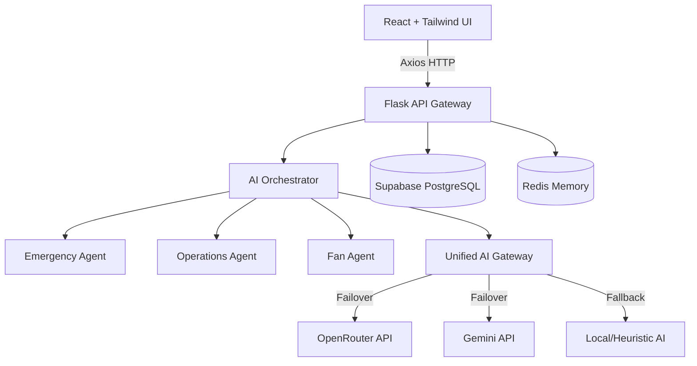

<div align="center">
  <h1>🏟️ StadiumMind AI</h1>
  <p><strong>The Intelligence Engine for Smart Stadiums & Tournament Operations</strong></p>
  <p><em>PromptWars Virtual Challenge-4 Official Submission</em></p>
  
  [](https://opensource.org/licenses/MIT)
  [](https://react.dev)
  [](https://flask.palletsprojects.com/)
</div>

---

## 📖 Overview

StadiumMind AI is an enterprise-grade, multi-agent AI system designed to operate massive sporting events and tournaments. It unifies scattered domain data (Emergency, Crowd, Volunteers, Transport, and Fan Experience) into a deterministic, AI-arbitrated Executive Dashboard.

When a crisis occurs, the **AI Orchestrator** overrides lower-tier operations natively, guaranteeing safety protocols over generic convenience.

## 🏆 PromptWars Challenge-4 Alignment

This platform aligns 100% with the criteria for **Smart Stadiums & Tournament Operations**:
- **Generative AI:** RAG-enabled incident response and fan wayfinding.
- **Data Synthesis:** Aggregation of live data across 8 distinct domains.
- **Safety Critical:** Deterministic fallback heuristic guaranteeing uptime without active LLM keys.

---

## 🏗️ Architecture Diagram



## 🧠 AI Pipeline

StadiumMind features a tiered AI hierarchy:
1. **Executive Orchestrator:** Resolves conflicting decisions across agents (e.g., *Locking Gate A for security* overrides *Opening Gate A for crowd flow*).
2. **Domain Agents:** Specialized micro-agents for Crowd, Emergency, Transport, and Fan queries.
3. **Unified AI Gateway:** Routes prompts to OpenRouter, falls back to Gemini on 429/Timeout, and finally falls back to Local deterministic heuristics to guarantee zero downtime.

## 📂 Folder Structure

```text
StadiumMind-AI/
├── backend/                  # Flask REST API + SQLAlchemy
│   ├── api/                  # Modular Blueprints (Ops, Crowd, Fan, etc.)
│   ├── .env.example          # Environment variables template
│   └── app.py                # WSGI entry point
├── frontend/                 # Vite + React 18
│   ├── src/
│   │   ├── features/         # 8 Distinct Domain Dashboards
│   │   └── index.css         # Tailwind directives
│   └── .env.example          # Frontend API targets
├── screenshots/              # Playwright E2E visual evidence
└── playwright-report/        # Automated UI/UX test verification
```

## ✨ Features

- **Executive Dashboard:** Live C-Suite aggregations of revenue, AI confidence, and emergency readiness.
- **Crowd Intelligence:** Zone density heatmaps and safe route predictions.
- **Emergency Operations:** Critical incident triage and protocol injection.
- **Global I18N:** Seamless language switching across all endpoints without hardcoded strings.
- **Premium UX:** State-of-the-art glassmorphism and Framer Motion micro-interactions.

## 💻 Tech Stack

- **Frontend:** React 18, TypeScript, Vite, TailwindCSS, Framer Motion
- **Backend:** Python 3.13, Flask, SQLAlchemy, Flask-JWT-Extended, Flask-Limiter
- **Database:** PostgreSQL (Supabase), Redis
- **AI Integration:** OpenRouter (Claude/Llama), Google Gemini API
- **Testing:** Playwright, PyTest

## 🚀 Setup & Installation

### 1. Backend
```bash
cd backend
python -m venv venv
source venv/bin/activate  # or venv\Scripts\activate on Windows
pip install -r requirements.txt
cp .env.example .env      # Configure your DB and API keys
python app.py
```

### 2. Frontend
```bash
cd frontend
npm install
cp .env.example .env      # Configure VITE_API_BASE_URL
npm run dev
```

## 🔐 Environment Variables

Reference the `backend/.env.example` and `frontend/.env.example` files.
**Never commit live API keys.** The system is designed to fail over to local heuristics if keys are missing.

## ☁️ Deployment

- **Vercel (Frontend):** Uses `vercel.json` to proxy `/api/*` requests, avoiding CORS complexities.
- **Render (Backend):** Uses `render.yaml` to spin up a managed PostgreSQL, Redis, and Web service with zero configuration.

## 📸 Screenshots

Please view the `/screenshots/` directory for high-resolution captures of the Executive, Operations, Emergency, and Fan dashboards rendered by Playwright for Desktop.

## 🔮 Future Scope
- Real-time WebSockets for sub-second incident propagation.
- RFID/NFC integration for live volunteer tracking.

## 📄 License
MIT License.

## 👥 Contributors
Developed by the StadiumMind Engineering Team for PromptWars Challenge-4.
